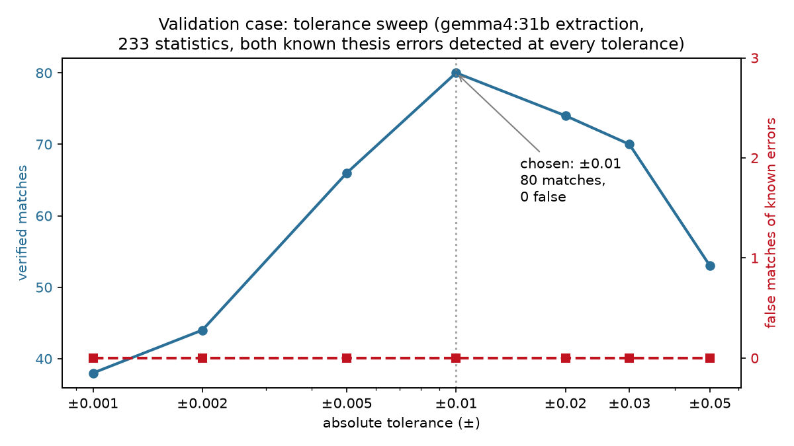

# project-veritas 🔬

> **AI-use disclaimer:** built with AI assistance under my direction,
> review, and design decisions — every feature, threshold, and test
> protocol was chosen by me, and the validation case (my own thesis,
> with independently known errors) was my design. AI accelerated the
> work; it did not make the scientific decisions.

**A statistics auditor for published research papers.** Give it a paper
and the raw data behind it; it extracts every published statistic,
recomputes each one from the data, and tells you — with the exact
computation attached — which numbers check out and which don't.

Built and validated on a real case: it audited my MD thesis on REM vs
NREM sleep apnea and flagged **both known value errors** in it (errors
independently confirmed by a separate hand analysis of the raw data).

---

## Why

Published statistics are rarely re-checked. Errors — a transposed digit,
an SD copied into the wrong cell, a mean that isn't the mean of the
cohort — survive into the literature because verification is tedious.
project-veritas makes it mechanical: the auditor never takes the paper's
word, it recomputes from raw data and shows the exact expression that
produced each verdict.

## How it works

```
paper (txt/docx) ─┐
                  ├─► ingest ─► extract (LLM) ─► verify (battery) ─► report
raw data (csv/xlsx)┘            │                │
                                │                │
                          every statistic    each statistic recomputed
                          with its snippet   from the data (pandas),
                          validated & deduped  verdict + provenance
```

1. **Extract** — an LLM (default: gemma-4-31b via any OpenAI-compatible
   endpoint) reads the paper in chunks and proposes every statistic:
   value, kind (mean/std/count/p/r/other), table, and the exact snippet
   containing it. A deterministic gauntlet then checks each proposal:
   the value's digits must appear in the snippet, kinds must come from a
   fixed vocabulary, duplicates are dropped. The LLM is never trusted
   beyond its proposals.
2. **Verify** — no LLM here. A *battery* recomputes what the data can
   produce: every mean, SD, min, max, median, count — overall, by cohort
   size, and per subgroup. Each published statistic is compared to the
   battery under a strict ±0.01 absolute tolerance (justified by a
   tolerance sweep — see validation below), with semantic de-duplication
   of the battery (cohort-size echoes and relabeled group splits removed)
   so matches stay unique.
3. **Verdicts with provenance** — every result carries the exact pandas
   expression that produced the battery number, e.g.:

   > MATCH: Total Sleep Time (Male) = 362.04 →
   > `df.loc[df['sex']==1, 'tst_min'].mean()` = 362.0437

   Ambiguities (a published value tying two battery entries) go to the
   user as a resolution dropdown listing every tying candidate — nothing
   is silently guessed.

## The validation case

I validated it against my own thesis — whose errors are independently
known from a prior hand analysis:

| Known error | Published | True value | Tool verdict |
|---|---|---|---|
| REM-AHI total mean | 59.92 | 54.92 | **NO MATCH** (all 3 occurrences) |
| REM-AHI female SD | 31.04 | 41.04 | **NO MATCH** |

**2/2 value errors detected, zero false verifications** — at every
tolerance tested (±0.001 … ±0.05). A third, test-selection error (a
one-sample t-test presented in a REM-vs-NREM context) is documented but
out of scope: value verification checks numbers, not test choices.

The tolerance was chosen empirically: a sweep from ±0.001 to ±0.05 shows
matches peaking at ±0.01 (80 verified of 233 extracted) with zero false
matches of the known errors at *every* tolerance — the tolerance choice
is justified by coverage, not risk.



**Run summary (233 statistics extracted from the 23k-char thesis):**

| Verdict | n | Meaning |
|---|---|---|
| MATCH | 59 | recomputed from data, expression shown |
| MATCH (restatement) | 21 | the paper restates a verified number in prose |
| NO MATCH | 56 | no data-supported value (incl. the 2 known errors) |
| COLLISION | 9 | genuine ties → user resolves via dropdown |
| UNCHECKABLE | 88 | p-values, r coefficients, subgroup stats — battery roadmap |

Full methodology and per-model results: [`docs/`](docs/).

## Model choice — measured, not assumed

Four extraction models were compared on identical protocol
([10-chunk A/B](docs/model_ab_10chunk.md), then full-paper runs).

**10-chunk A/B** (chunks 0–9, identical pipeline and audit):

| Model | Time (s) | Stats | MATCH | NO MATCH | COLLISION | UNCHECKABLE |
|---|---|---|---|---|---|---|
| GLM-4.7-flash (reasoning) | 461 | 26 | 6 | 14 | 3 | 3 |
| nemotron-3-super | 177 | 25 | 4 | 10 | 0 | 11 |
| gemma4:31b | **23** | 23 | 6 | 10 | 3 | 4 |
| ling-3.0-flash | 63 | **31** | 6 | 14 | 3 | 8 |

gemma-4-31b was 20× faster than GLM and 7.7× faster than nemotron; all
four passed every proposed statistic through the validation gauntlet
(zero discard noise). The strict ±0.01 audit even caught GLM emitting an
age range ('20–65') as one malformed statistic, which nemotron and gemma
both split correctly.

**Full-paper runs** (all 36 chunks):

| Model | Full-paper extraction | Verified matches |
|---|---|---|
| GLM-4.7-flash (reasoning) | — died at 7 h / never finished | — |
| nemotron-3-super | — | — |
| ling-3.0-flash | 6.5 min, 234 stats | 70 |
| **gemma-4-31b (default)** | **4.3 min, 233 stats, no gaps** | **80** |

Nine statistics were found identically by all four models (consensus
core). The audit's verdicts are model-independent: the *verifier* is the
referee; the extractor only proposes.

## Features

- **RAG chat about the paper** — every answer carries its source excerpts
  (persisted per message, checkable at any time), with deterministic
  refusal when the document can't support the question.
- **Audit with human-in-the-loop resolution** — collisions become
  dropdowns of the actual tying battery expressions; known-safe skips
  (external-literature values, methodology constants) are operator
  decisions with logged reasons.
- **Honest failure** — unknown LLM layouts are reported, never guessed;
  endpoints are live-verified before anything runs; stalled calls fail
  fast (15 s pings / 120 s chat & extraction) instead of hanging.
- **First-run setup** — bring your own OpenAI-compatible endpoints (local
  LM Studio, Ollama, hosted routers); keys stay in `~/.veritas/`, never
  in the repo.

## Quick start

```bash
git clone https://github.com/Mahyarrk/project-veritas
cd project-veritas
uv sync                      # python 3.12, deps from pyproject.toml
uv run streamlit run gui.py  # endpoint setup → Audit | Chat | About
```

CLI equivalent:

```bash
uv run main.py paper.txt data.csv            # full pipeline + chat
uv run main.py paper.txt data.csv --no-chat  # audit only
uv run validate_case.py                      # reproduce the validation case
```

Configure the extraction model in `config.yaml` (any OpenAI-compatible
endpoint; API key via environment variable, never stored in the repo).

## Honest limitations

1. **One validation case.** I built and tuned the tool on a single
   paper — my own thesis. It has not yet been run blind on third-party
   papers; that is the immediate next step.
2. **Value errors only.** The auditor verifies whether published numbers
   match the data. It cannot detect wrong test choices (t-test vs
   paired), wrong denominators beyond the data's cohorts, or selective
   reporting.
3. **The data must be the included cohort.** If the paper excluded
   participants, the file must contain only the included cases — the
   disclaimers state this because auditing unfiltered data produces
   false mismatches (I observed exactly that before fixing the input).
4. **Statistical scope.** p-values, correlation coefficients, and
   subset statistics (e.g. a BMI≥30 subgroup) are extracted but not yet
   recomputable — the battery computes means/SDs/min/max/median/count
   overall and per categorical split. Correlation and subgroup batteries
   are the roadmap's next verification features.
5. **Extraction is LLM-proposed, LLM-dependent.** The gauntlet catches
   malformed proposals (observed: one model emitted '20–65' as a single
   "min" — rejected), but no extraction is exhaustive; a token-limited
   chunk is flagged, never silently dropped.

## Author

**Dr Mahyar Mirzazadeh, M.D.** —
[LinkedIn](https://www.linkedin.com/in/mahyar-mirzazadeh-550b3b166)

## Repository layout

```
ingest.py      document + data loading, chunking, embeddings
retrieve.py    cosine retrieval with provenance, refusal floor
chat.py        multi-turn RAG with query rewriting
extract.py     LLM statistic extraction + validation gauntlet
verify.py      battery auditor: recompute, match, resolve, report
main.py        CLI entry: capability tiers, pipeline
gui.py         Streamlit UI (endpoints → audit → chat)
setup.py       first-run endpoint configuration
validate_case.py  formal scoring against known thesis errors
config.yaml    endpoints, models, retrieval params, paths
docs/          validation case, model A/B, run reports
sources/       thesis_en.txt (the public validation corpus)
```