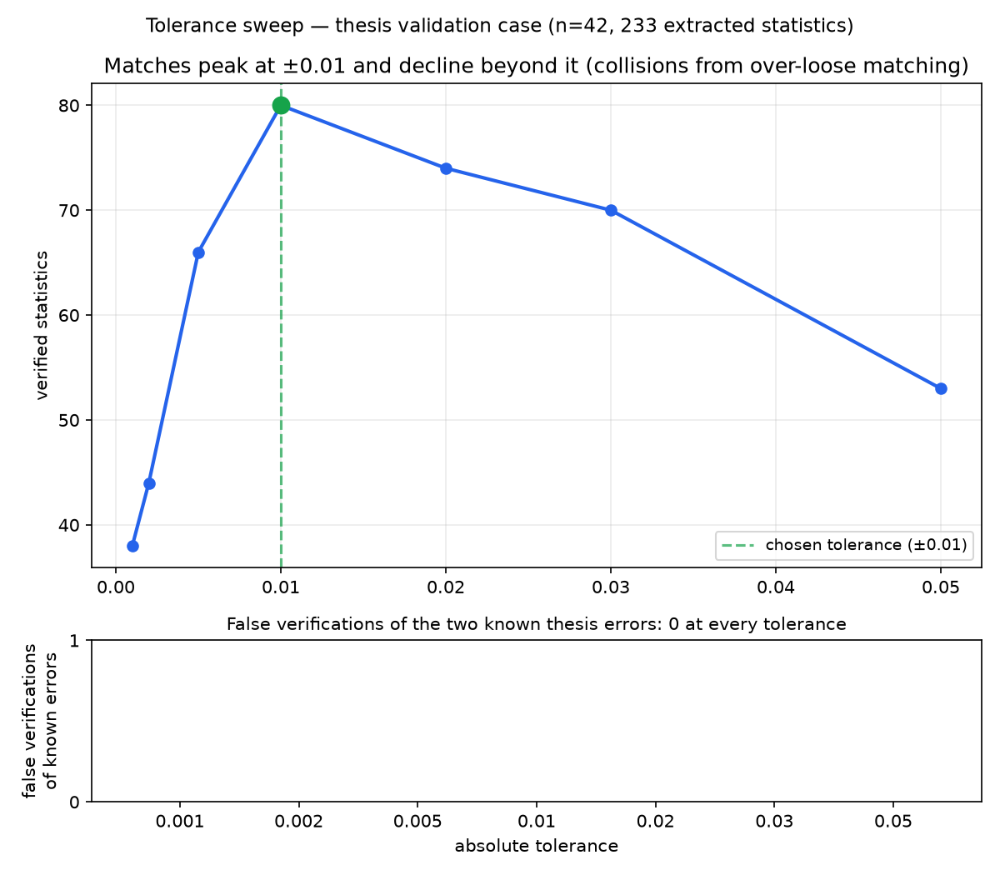

# project-veritas

**An AI-powered statistical auditor for scientific papers — verify a paper's published numbers against its own raw data.**

Author: **Dr Mahyar Mirzazadeh, M.D.** — [LinkedIn](https://www.linkedin.com/in/mahyar-mirzazadeh-550b3b166)

## What it does

Give it two things:
1. **A scientific paper** (txt/docx)
2. **The raw dataset** behind that paper (csv/xlsx)

project-veritas extracts every published statistic from the paper using an
LLM, then **recomputes each one directly from the raw data** and reports,
per statistic, whether it reproduces — with the exact pandas expression
that proved it.

It found real errors in a real MD thesis: a wrong mean (59.92 published vs
54.92 in the data) and a wrong SD (31.04 vs 41.04) — both correctly
flagged, in all 4 restatements across the paper, with **zero false
verifications at any tolerance setting**.

*(The validation case is the author's own MD thesis — a 42-patient PSG
cohort from an obstructive sleep apnea / REM-AHI study, whose errors were
independently established in a prior hand-audit of the raw data and
archived SPSS outputs.)*

## How it works

```
paper.txt/docx ──┐
                 ├─→ ingest ─→ extract (LLM) ─→ verify (pandas battery) ─→ audit report
data.csv/xlsx ───┘                                                        │
                                                                          ▼
                                                              RAG chat about the paper
```

- **Ingest** — papers chunked and embedded; data schemas registered
- **Extract** — the LLM proposes statistics (value, kind, table, verbatim
  snippet); every proposal passes a deterministic validation gauntlet
  (digits-must-appear-in-snippet, kind allowlist, dedup) — the LLM is
  never trusted blindly
- **Verify** — a battery of statistics computed from the raw data
  (means/SDs per column and per subgroup, row counts, subgroup sizes);
  each published number is matched against this battery under a strict
  tolerance (±0.01 absolute)
- **Report** — verdicts per statistic (see verdict types below)
- **Chat** — RAG mode: ask questions about the paper with
  retrieval-backed answers and deterministic refusal when the answer
  isn't in the document

## Verdict types

| Verdict | Meaning |
|---|---|
| MATCH | unique battery entry reproduces the published value |
| MATCH (restatement) | the paper repeats a verified number in prose under a different label — tied to the original battery item |
| MATCH (human-selected) | user picked the correct battery entry from a candidate list |
| MATCH (restatement, user-confirmed) | user confirmed a restatement against a consumed entry |
| NO MATCH IN BATTERY | no battery entry within tolerance — a potential error, or a statistic the data can't support |
| UNRESOLVED COLLISION | 2+ battery entries tie the value — requires human judgment |
| UNCHECKABLE (kind=other) | p-values, correlations, percentages — not in the descriptive battery |

## How user interaction works

When a published statistic cannot be resolved automatically, the tool
pauses and asks. Interaction happens in three situations, each shown with
its candidates:

1. **COLLISION — one published value, several battery entries.** The user
   sees every tying candidate with its description and value and picks
   the right one. Example from the validation case: the paper's
   NREM-AHI female mean (62.30) tied two battery entries —
   `mean of ahi_nonrem where sex=2` (the true source) and
   `mean of ahi_rem where mallampati_score=2+` (a numerical coincidence).
   The user picks; the tool records which was chosen and why.
2. **NO MATCH with consumed candidates.** The battery entry matching a
   published value may already have been consumed by an earlier, differently
   labeled restatement of the same result. The tool lists those consumed
   entries marked `[used]`; selecting one records MATCH (restatement,
   user-confirmed) — the paper repeated a number the tool had already
   verified.
3. **UNCHECKABLE statistics.** p-values, correlations, percentages: no
   battery support (yet). The user can relabel the kind (if the extractor
   mislabeled it — relabeling re-searches the battery) or skip.

Interaction is optional: `--no-chat`-style batch runs auto-skip anything
ambiguous (recorded in the report with reasons), and the interactive
session is exactly where a reviewer's judgment adds value the automation
cannot.

## Validation results

The tool was validated against the author's own MD thesis (42-patient PSG
cohort, OSA/REM-AHI study), whose errors were independently established in
a prior hand-audit. **Two value errors, both detected, zero false
verifications** — and this held at *every* tolerance setting tested
(0.001–0.05).

### Known-error detection

| Known error | Published | True (data) | Occurrences in paper | Detected |
|---|---|---|---|---|
| REM-AHI total mean | 59.92 | 54.92 | 3 | **all 3 flagged** |
| REM-AHI female SD | 31.04 | 41.04 | 1 | **flagged** |

A third thesis error (Table 13's t-statistic attached to the wrong test)
is a *test-selection* error, not a value error — the tool verifies values
against data and cannot judge which test the author should have run;
documented, not scored.

### Tolerance sweep — why ±0.01



Matches peak at ±0.01 and *decline* beyond it — looser matching creates
collisions that go unresolved. Zero false verifications at any tolerance.
Strict tolerance isn't just safer, it's more productive.

## Model comparison

Four LLMs were benchmarked on identical extraction/audit pipelines. Two
protocols: a 10-chunk A/B (Abstract → early Results) and full-paper runs
(all 36 chunks, table-heavy Results section included).

### 10-chunk A/B

| Model | Time (s) | Stats | MATCH | NO MATCH | COLLISION | UNCHECKABLE |
|---|---|---|---|---|---|---|
| GLM-4.7-flash (reasoning) | 461 | 26 | 6 | 14 | 3 | 3 |
| nemotron-3-super | 177 | 25 | 4 | 10 | **0** | 11 |
| gemma4:31b | **23** | 23 | 6 | 10 | 3 | 4 |
| ling-3.0-flash | 63 | **31** | 6 | 14 | 3 | 8 |

Key findings: 9 statistics found identically by all four models (the
Methods core — age range, all six exclusion counts, headline p-value);
GLM produced the only malformed extraction (an age range as one min-stat
— caught by the strict tolerance); nemotron was most conservative; ling
over-extracted (AASM scoring definitions flagged as statistics).

### Full-paper runs (all 36 chunks, incl. the Table 6/10/11 gauntlet)

| Model | Time | Stats | MATCH | Restate | Total verified | NO MATCH | UNCHECKABLE | Coverage gaps |
|---|---|---|---|---|---|---|---|---|
| ling-3.0-flash | 390 s | 234 | 50 | 20 | 70 | 62 | 93 | 1 (token limit) |
| **gemma4:31b** | **257 s** | 233 | **59** | **21** | **80** | **56** | **88** | **0** |

Both models verified the paper's complete descriptive core with
provenance, and both flagged both known errors. gemma4:31b: faster,
complete coverage, 10 more verified statistics — selected as the
extraction engine. Per-chunk speed on the dense table sections:
gemma 13-29 s per chunk vs GLM's 20-35 *minutes*.

### Interactive run (gemma4:31b, full paper, 233 statistics)

153 interactive prompts were driven by an operator applying a published
decision policy (known errors must never match; external-literature
values skipped; subgroup statistics skipped pending battery features).

| Outcome | n |
|---|---|
| Operator-decided (policy) | 37 |
| Deferred to tool resolution | 116 |
| Known-error statistics force-matched | **0** |

The core safety property held under human interaction: the wrong numbers
were never offered a legitimate-looking candidate to click — 59.92 has no
true counterpart in the data, so no prompt could make it match.

## Files

| File | Purpose |
|---|---|
| `ingest.py` | document + data loading, chunking, embeddings |
| `retrieve.py` | cosine retrieval, refusal floor |
| `chat.py` | multi-turn RAG chat |
| `extract.py` | LLM statistic extraction + validation gauntlet |
| `verify.py` | statistics battery + matcher + tolerance + used-pool |
| `main.py` | capability-tier dispatcher |
| `validate_case.py` | formal validation vs known errors |
| `make_sweep_figure.py` | tolerance-sweep figure |
| `docs/` | model A/B, run analyses, interactive test log |

## Honest limitations

- Verified on **one validation case** (n=42 cohort, 233 statistics, one
  domain). Awaiting external validation on public datasets.
- Catches **value errors**; cannot detect test-selection errors (correct
  value, wrong test).
- The battery computes descriptive statistics (means/SDs/counts by column
  and subgroup). t-tests, ANOVA, correlations: not yet in the battery.
- Coverage depends on the dataset: percentages/derived indices are flagged
  unverifiable when their underlying columns aren't provided — correct
  behavior, incomplete coverage.
- The matcher resolves numeric ties by human judgment; semantic matching
  (using the published row/column labels to prune candidates
  automatically) is a future upgrade.

## Notes

- The validation corpus (translated thesis) is in the repo;
  **patient-identifying data is not** (all CSVs gitignored).
- Requires Python 3.12+, an OpenAI-compatible LLM endpoint, and an
  embeddings endpoint.
- Built as a first serious Python project; code review welcome.